# آزمایش چهارم
## سوال ۱

با اجرای برنامه در ابتدا مشکل در اندازه هیپ پیش می‌آمد،
در نتیجه قسمتی از کد یک حلقه ۱۰۰۰۰تایی داریم را تغییر داده‌ایم و به ۵۰۰۰ کاهش داده‌ایم.
سپس برنامه را با ورودی‌های زیر اجرا کرده‌ایم. خروجی برنامه هم در تصویر زیر پیدا است:

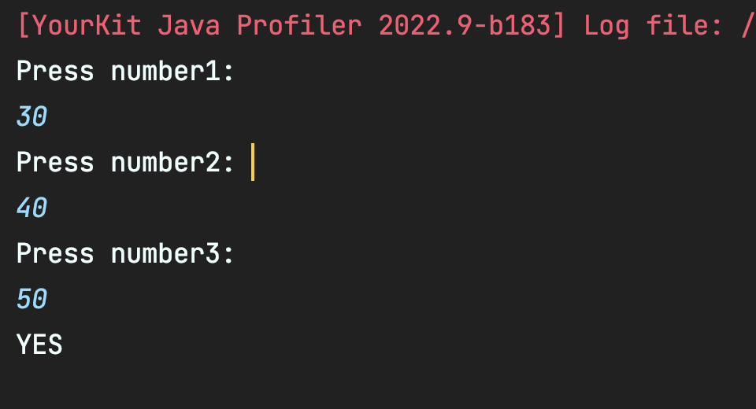

در تصویر زیر نیز می‌توان میزان زمان مصرفی توابع مختلف را مشاهده کرد:

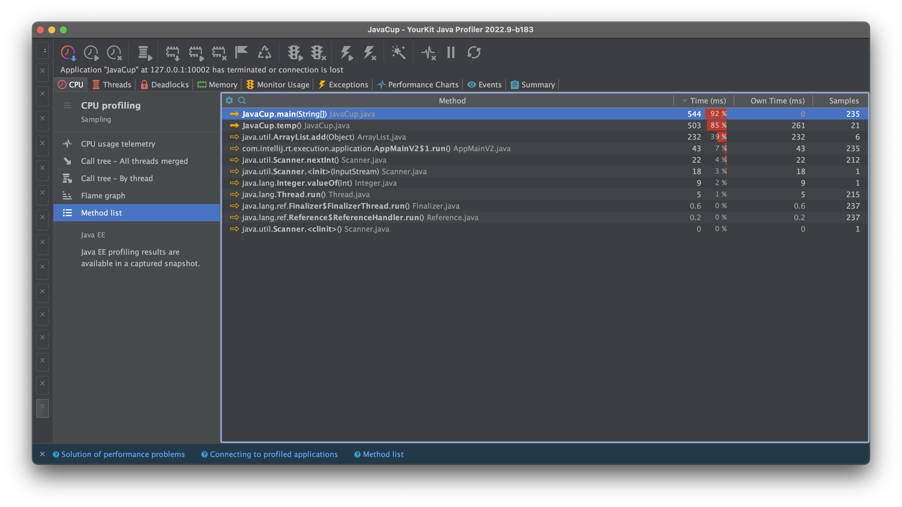

 همانطور که مشاهده می‌شود بیشترین زمان بعد از تابع main
توسط تابع temp استفاده شده‌است که کد آن را می‌توان در زیر مشاهده کرد: (همچنین بعد از آن بیشترین زمان مصرفی برای کار با scanner و دریافت ورودی بوده است.)

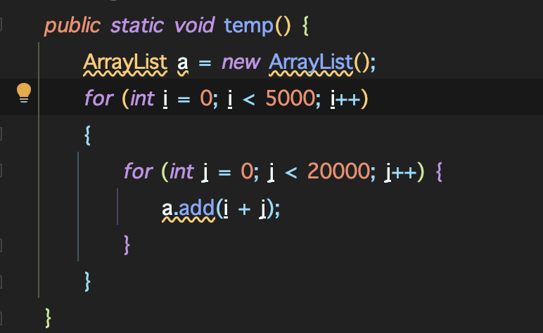

همانطور که مشاهده می‌شود این تابع شامل یک for تو در تو می‌شود که در هر تکرار یک عضو به آرایه a اضافه می‌کند،
 که همین قسمت در حالت اولیه باعث پر شدن حافظه heap می‌شده. همچنین این for تو در تو باعث می‌شود که زمان زیادی از اجرای
 کد صرف اجرای این تابع شود. با توجه به تصویر قبل ۳۹٪ زمان اجرا صرف اضافه شدن اعضای جدید به آرایه a می‌شود.

میزان مصرف CPU:

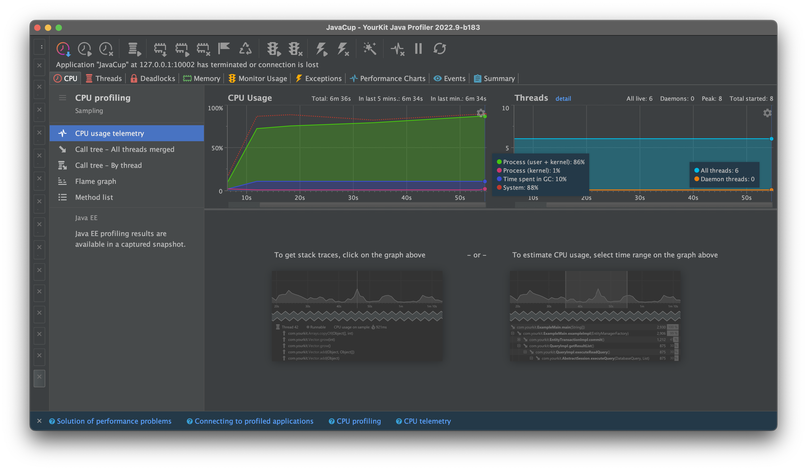

میزان مصرف Memory:

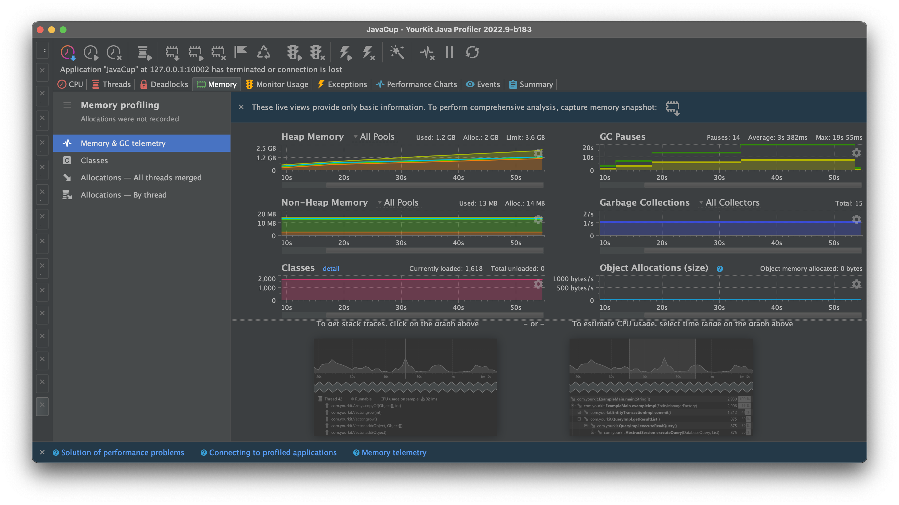

## سوال ۲

در این قسمت یک کد برای محاسبه عضو nام از دنباله فیبوناچی نوشته‌ایم.
در ابتدا این‌کار را به صورت بازگشتی انجام می‌دهیم. تصویر اجرا و خروجی را می‌توانیم در زیر مشاهده کنیم:

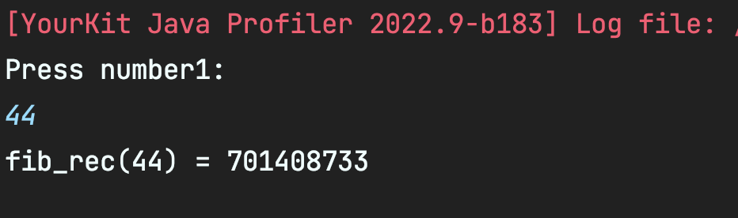

 زمان اجرای توابع مختلف آن را نیز می‌توانیم در تصویر زیر مشاهده کنیم:

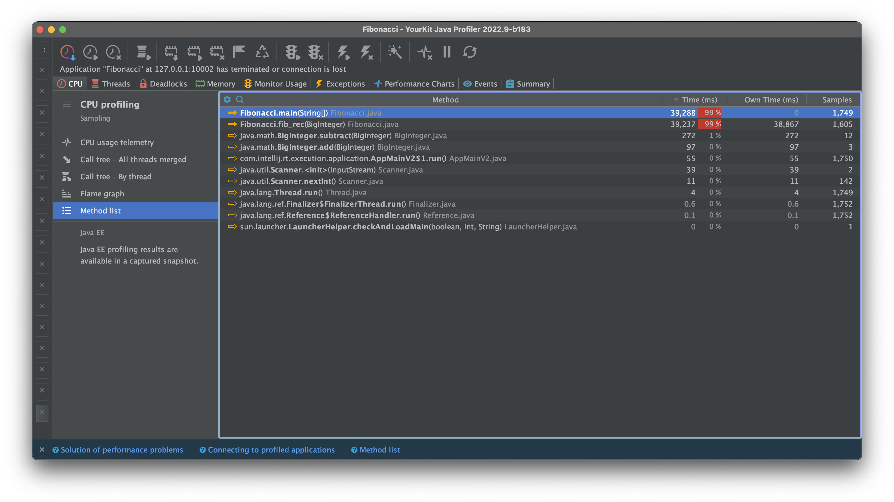

قطعه کد بازگشتی این قسمت را می‌توان در تصویر زیر مشاهده کرد. زمان اجرای این قطعه کد 
O(2^n) است 
و همانطور که انتظار می‌رود زمان اجرای آن در nهای بسیار بزرگ می‌شود، و مطابق انتظار همانطور
 که در تصویر قبل قابل مشاهده‌است ۹۹٪ زمان اجرای برنامه صرف اجرای این تابع می‌شود.

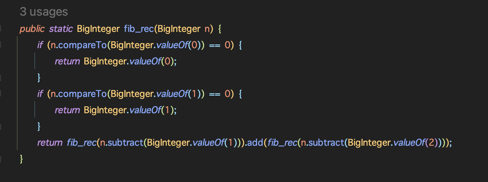

میزان مصرف CPU:

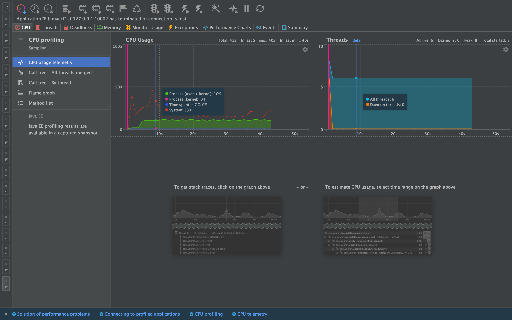

میزان مصرف Memory:

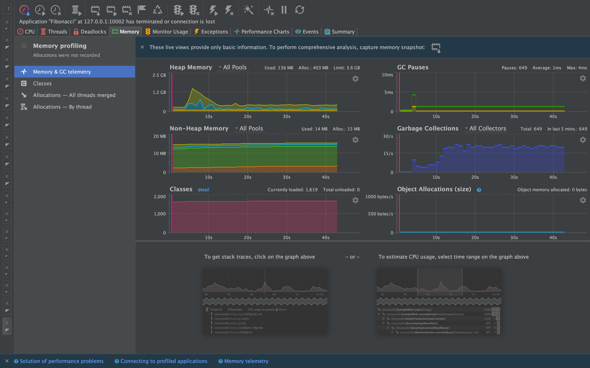

حال تابع بازگشتی فیبوناچی را به iterative تغییر می‌دهیم. کد این قسمت را نیز می‌توان در تصویر زیر مشاهده کرد.
همچنین زمان اجرای این قطعه کد از O(n) است، که انتظار می‌رود در مقایسه در با کد قبلی بسیار سریعتر عمل کند:

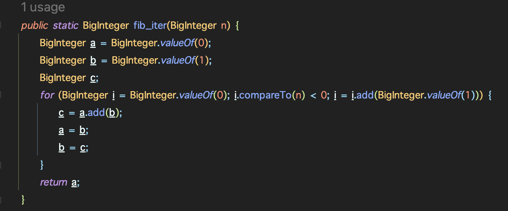

اجرای کد و خروجی کد را نیز می‌توان در تصویر زیر مشاهده کرد:
 (برای اینکه زمان اجرا طولانی تر شود عضو بزرگتری از دنباله فیبوناچی در این حالت انتخاب شده‌است.)

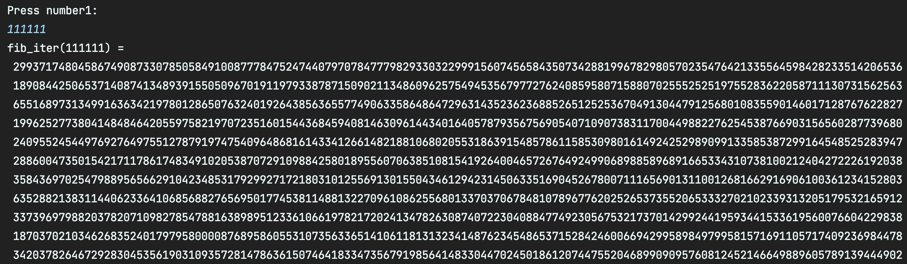

در این قسمت نیز می‌توان زمان اجرای توابع مختلف را مشاهده کرد.
همانطور که مشاهده می‌شود با اینکه ورودی این تابع خیلی از حالت قبل بیشتر است اما زمان اجرای
 این تابع بسیار کمتر از حالت قبل است و فقط ۵۹٪ از زمان اجرا را این تابع استفاده می‌کند.

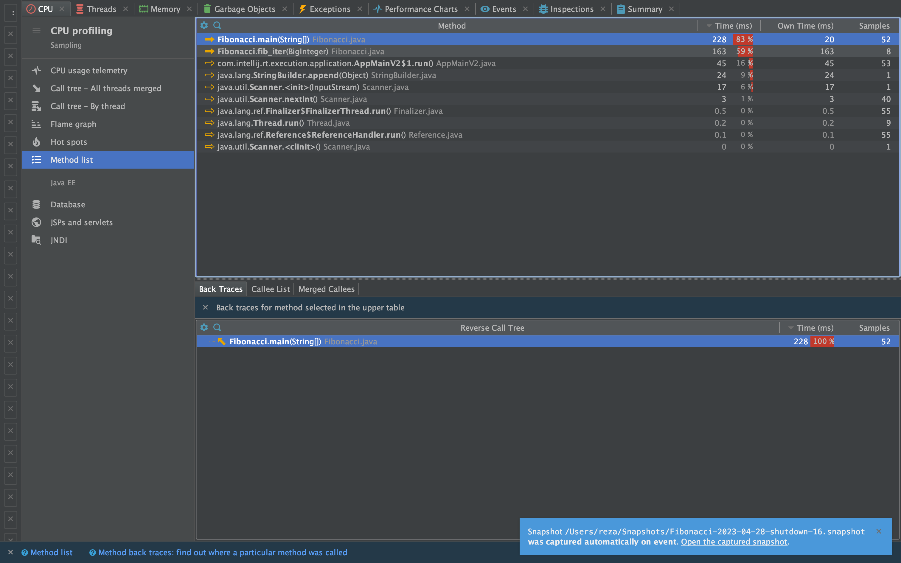

میزان مصرف CPU:

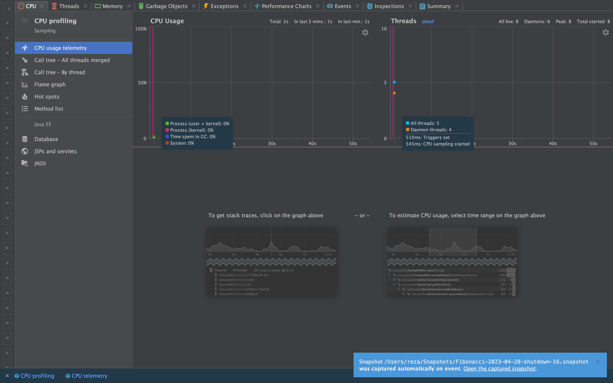

میزان مصرف Memory:

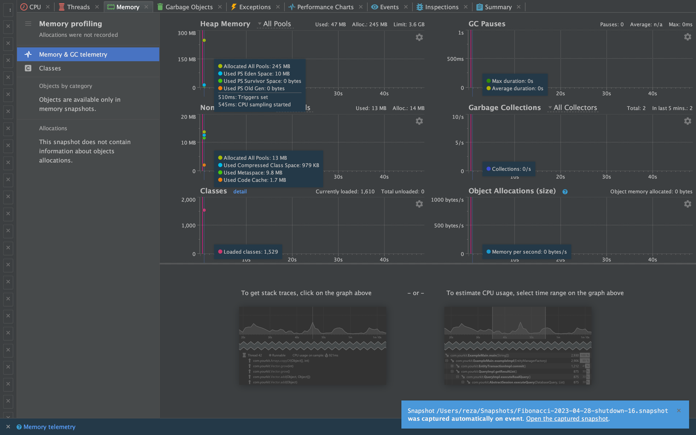

